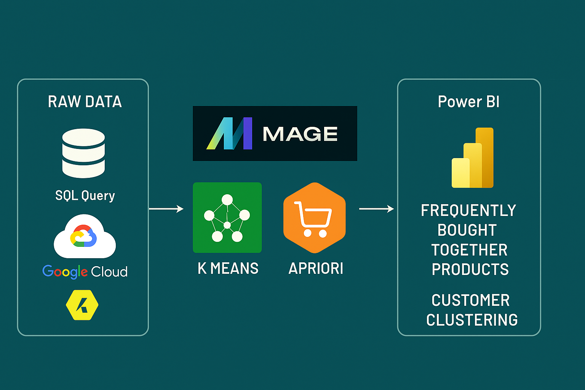

# Product portfolio Optimization | Data mining for sales improvement 

## Introduction

  ### Product Relationship & Customer Behavior Analysis Engine 🛠️ 
Data engineering solution designed to uncover valuable relationships between products and understand customer purchasing behavior, enabling businesses to unlock cross-selling opportunities and drive data-informed product recommendations.

At its core, the engine analyzes transaction data to identify products frequently bought together — providing actionable insights to optimize product bundling and marketing strategies.

  ### Key Features 🔍
Product Association Analysis: Automatically detects product combinations that are frequently purchased together, revealing hidden affinities within a product portfolio.

Optional Customer Clustering: Uses behavioral segmentation to group customers with similar buying patterns, enabling targeted recommendations and more accurate cross-sell strategies per segment.

Flexible Data Ingestion: Connects seamlessly to SQL databases, CSV files, or cloud storage sources.

Business Intelligence Ready: Designed to integrate with Power BI for clear, dynamic visualizations that translate technical insights into strategic actions.

  ### Use cases🚀
  
By combining product association mining and customer clustering, this tool enables both general analysis and segmented insights — making it easier to:

Personalize marketing campaigns

Improve product placement strategies

Identify high-potential product pairings

Tailor offerings per customer segment

## Architecture

## Business Insights 

[See possible example business insights ](Business-insights.md)

