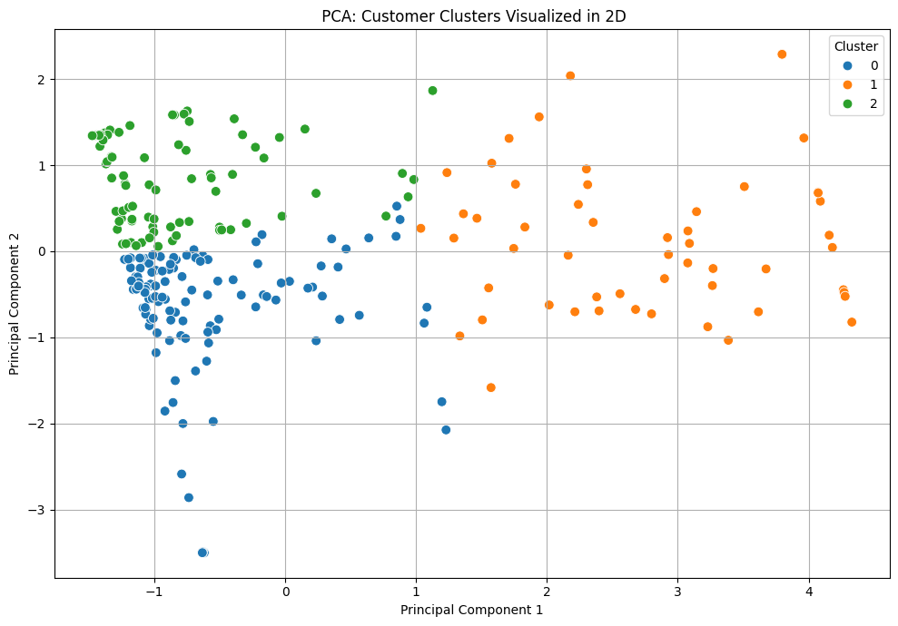
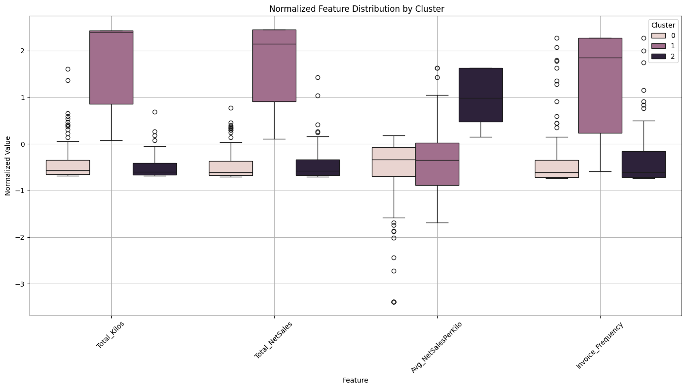
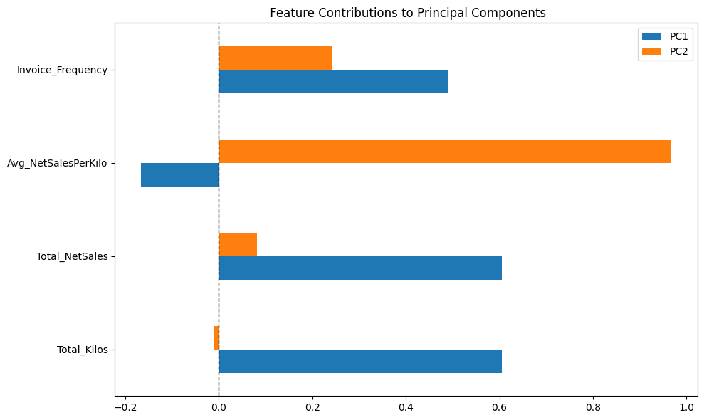
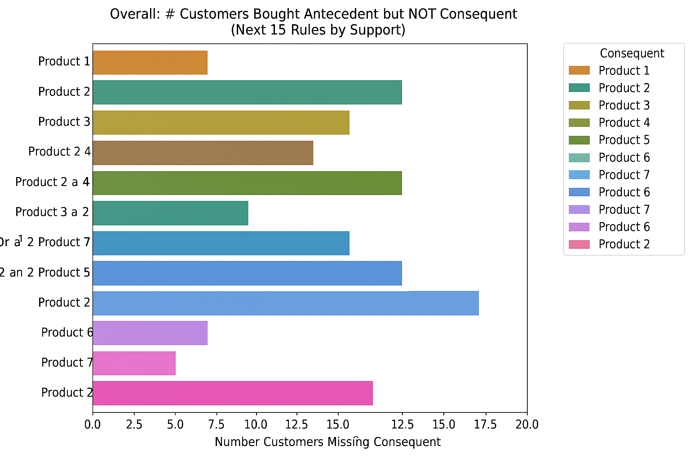

# Business Insights from Clustering and Association Analysis 📊
This solution enables businesses to uncover actionable product associations and customer segmentation patterns by analyzing purchasing behavior. Below are example insights derived from deploying the model on a sample dataset.

## Customer Clustering: Understanding Different Behaviors 👥
The clustering process allows us to group customers based on purchasing behavior, enabling more tailored insights and recommendations. In this example, the algorithm successfully identifies three distinct customer segments, each with unique characteristics.
By visualizing these clusters, we observe clear separation, indicating meaningful behavioral differences across groups.

## Feature Distribution Across Clusters 📦
To better understand what differentiates these customer groups, we generated a boxplot of normalized feature distributions. This visualization helps us interpret which features (e.g., Total_Kilos, Avg_NetSalesPerKilo, Invoice_Frequency) define each cluster and draw customer personas for explainability and targeted strategy.

## Feature Contribution to Clustering 📈
The feature contribution plot reveals which variables are most influential in separating clusters. This bivariate principal component analysis (PCA) shows that some features—like Average Net Sales per Kilo—have a greater impact on cluster differentiation, guiding us toward more strategic segmentation criteria.

## Differentiated Product Associations 🛒
The third chart shows that product associations vary across clusters. We analyze the frequency of top items purchased per cluster and overall, confirming that customer segments exhibit different buying patterns. This reinforces the value of clustering: it allows a more granular view of purchasing behavior and highlights distinct opportunities for cross-selling in each group.

## Targeted Cross-Selling Opportunities 🔁
Finally, by running association rule mining (Apriori algorithm) on both the overall dataset and within each cluster, we uncover the most frequent product pairs. These insights allow businesses to identify cross-sell targets: if a customer in a given cluster has bought one product, we can recommend its frequent pair based on similar behavior in their group—boosting conversion potential through behaviorally informed targeting.

